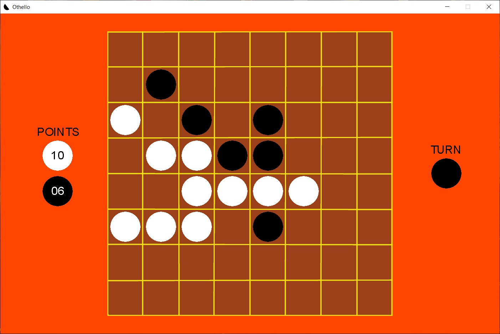
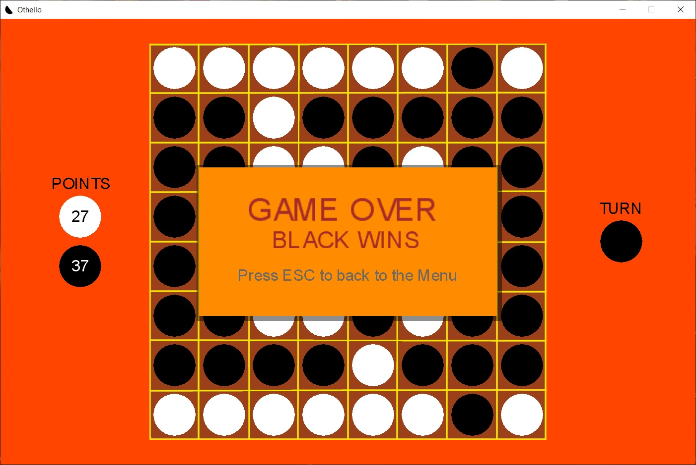
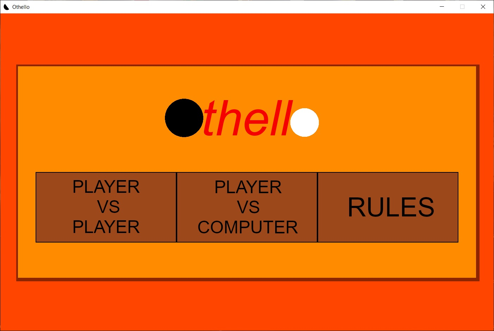
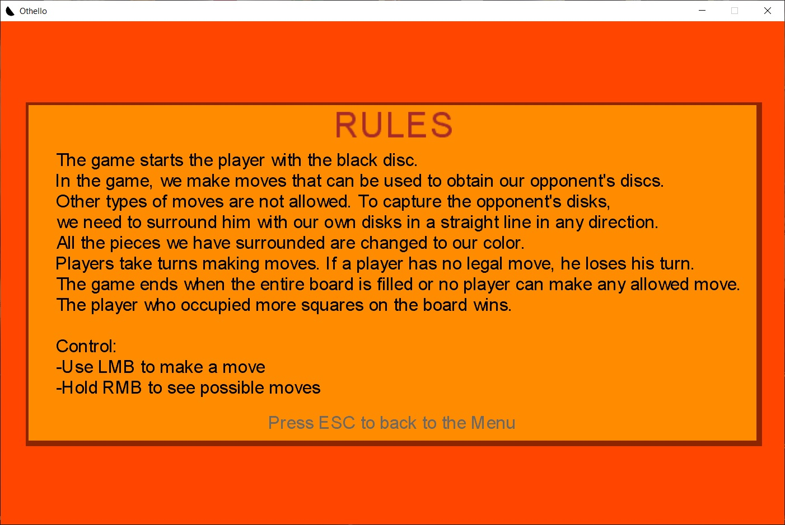

## Othello Monogame

The Othello game was developed using the **MonoGame** framework and features an artificial intelligence implemented with the **alpha-beta pruning** algorithm.

The evaluation function considers multiple factors, including the position values of board fields, the number of pieces on the board, the number of available moves, and the strategic importance of occupied corners and edges. These elements are weighted to enhance the quality of gameplay and AI decision-making.
##

